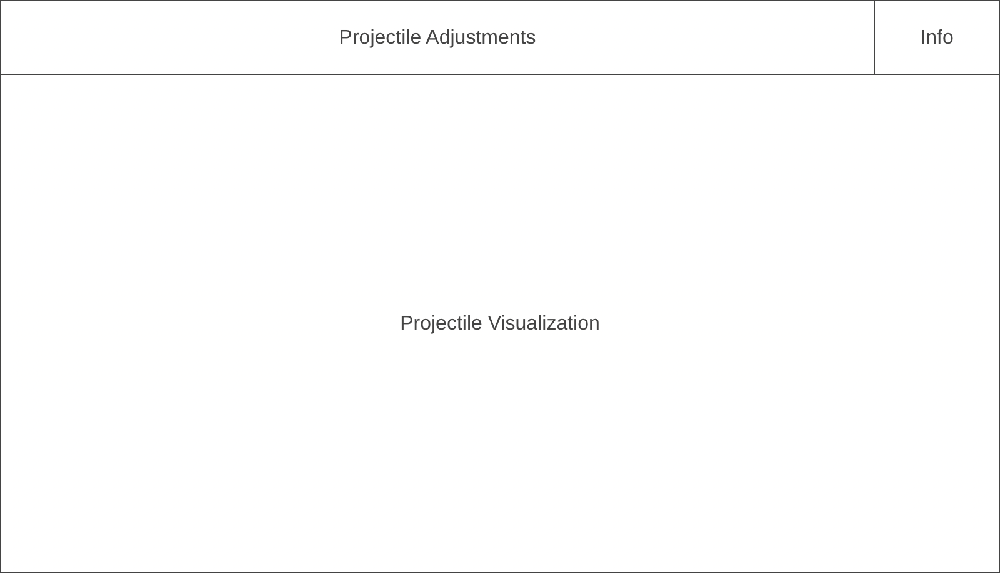

# JavascriptProject

Proposal: 2D Projectile Motion Simulator

## Background
2D Projectile Motion Simulator is a visual simulation of the classical mechanics problem of projectile motion. Simulations will be recorded for analysis by user.

## Functionality & MVP
Users will be able to...
* Choose a projectile's initial velocity, launch angle, launch height, launch force, mass, travel distance, travel height, and gravity.
* Run simulations and receive information about projectile
Additional...
* Start with instruction modal
* Open instructions modal from in app

## Wireframes
The app will have a single screen with an information modal. The controls and access to the information modal will be on a bar on top of the projectile visualizer.

## Architecture and Technologies
The project will use the following technologies:
* Javascript
* HTML Canvas
In addition to the entry file, this project will have the following two scripts:
projectile.js: this script will handle drawing the projectile
physics.js: this script will be in charge of moving the projectile using equations to replicate ideal projectile motion

## Implementation Timeline
Day 1: Assure skeleton is setup properly. Write basic entry file. Choose screen dimensions and place grid overlay. Learn how to normalize movement speed of projectile.
Day 2: Build projectile motion logic. Assure function works with hard coded inputs. Design user input and allow it to manipulate simulation.
Day 3: Create instructions modal. Create spreadsheet of inputs based off simulations. Allow for deletion of inputs.
Day 4: Allow user to choose height of initial projectile launch. Animate changes in height.

## Bonus Features
* Include air resistance
* Add "targets" and implement "game" mode allowing users to place the target at their calculated landing point.
