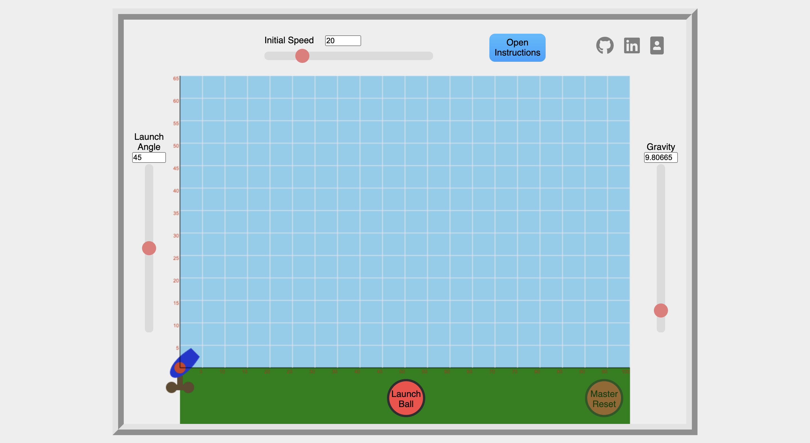
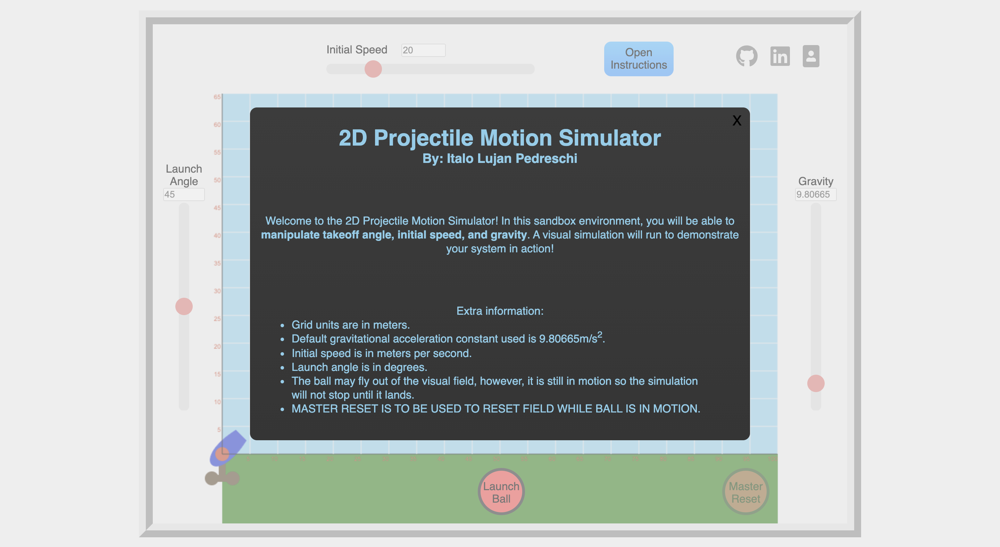

# 2DProjectileMotionSimulator


<div align="center">
  <a href="https://italolujan.com/2DProjectileMotionSimulator/">Live Site</a>
</div>

2D Projectile Motion Simulator is a visual simulation of the classical mechanics problem of projectile motion.


# Technologies Stack

* HTML with Canvas - Simple drawings and requestAnimationFrame allowed for smooth regulated framerate leading to predictable projectile speed
* CSS - Easy to implement styling
* Javascript - Allowed for DOM manipulation to allow for more function than a purely HTML/CSS combination


# Functionality & MVP
Users are be able to...
* Start with an instruction modal
* Choose a projectile's initial velocity, launch angle, and gravity.
* Run simulations and receive information about projectile flight including flight time, max height, and horizontal travel distance.
* Open instructions modal from in app

# Features

## Instructions Modal

The instructions modal can be pulled up at any time during application use. Ball flight will continue undisturbed when opened but all controls and buttons are be deactivated.



## Master Reset

After launch, the reset button becomes available after the projectile returns to make contact with y = 0m. In the case where this will never happen such as during a zero gravity launch, the master reset button allows for the reset of the projectile midway during flight.


## Album Create

The creation of an album required the ability to select and deselect images and for those images' styling to differ based on their state. The state included a photo_ids array to which the IDs of selected photos are added and deselected photos are removed. A conditional is used for this function. Vanilla DOM manipulation is used to add the "selected-for-album" class to the clicked image giving it the selected styling.
### Photo Selection
```
constructor(props) {
    super(props);
    this.state = {
        name: "new album",
        description: "",
        photo_ids: []
    }
    this.handleInput = this.handleInput.bind(this);
    this.handleSubmit = this.handleSubmit.bind(this);
    this.handlePhotoClick = this.handlePhotoClick.bind(this);
}

handlePhotoClick(e) {
    let photoId = parseInt(e.currentTarget.id);
    let checkPhotoAlreadySelected = this.state.photo_ids.indexOf(photoId);
    let new_photo_ids = Array.from(this.state.photo_ids);
    if (checkPhotoAlreadySelected === -1) {
        e.currentTarget.classList.add("selected-for-album");
        new_photo_ids.push(photoId);
        this.setState({ photo_ids: new_photo_ids });
    } else {
        e.currentTarget.classList.remove("selected-for-album");
        new_photo_ids.splice(checkPhotoAlreadySelected, 1);
        this.setState({ photo_ids: new_photo_ids });
    }
}
```
