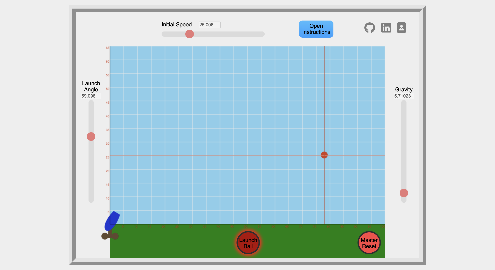

# 2DProjectileMotionSimulator


<div align="center">
  <a href="https://italolujan.com/2DProjectileMotionSimulator/">Live Site</a>
</div>

2D Projectile Motion Simulator is a visual simulation of the classical mechanics problem of projectile motion.


# Technologies Stack

* HTML with Canvas - Simple drawings and requestAnimationFrame allowed for smooth regulated framerate leading to predictable projectile speed
* CSS - Easy to implement styling
* Javascript - Allowed for DOM manipulation to allow for more function than a purely HTML/CSS combination


# Functionality & MVP
Users are be able to...
* Start with an instruction modal
* Choose a projectile's initial velocity, launch angle, and gravity.
* Run simulations and receive information about projectile flight including flight time, max height, and horizontal travel distance.
* Open instructions modal from in app

# Features

## Instructions Modal

The instructions modal can be pulled up at any time during application use. Ball flight will continue undisturbed when opened but all controls and buttons are be deactivated.


## Master Reset

After launch, the reset button becomes available after the projectile returns to make contact with y = 0m. In the case where this will never happen such as during a zero gravity launch, the master reset button allows for the reset of the projectile midway during flight.



## Drawing the Cannon

The drawing of the cannon was done in HTML canvas. This was nothing more than a simple bezier curve, however the cannon must rotate between being pointed East to North without any distortion. This was done by making all four points on the bezier curve the products of equations using the cannon angle as its only variable input.
### Bezier Curve Handling
```javascript
const cannonRadius = 40;
let topLipAngle = degreesToRadians(launchAngle + 15);
let adjustCannonTopX = (cannonRadius * Math.cos(topLipAngle));
let adjustCannonTopY = (cannonRadius * Math.sin(topLipAngle));
let lowerLipAngle = degreesToRadians(launchAngle - 15);
let adjustCannonBottomX = (cannonRadius * Math.cos(lowerLipAngle));
let adjustCannonBottomY = (cannonRadius * Math.sin(lowerLipAngle));
const bezierRadius = 50;
let topBezierAngle = degreesToRadians(launchAngle + 145);
let adjustBezierTopX = (bezierRadius * Math.cos(topBezierAngle));
let adjustBezierTopY = (bezierRadius * Math.sin(topBezierAngle));
let bottomBezierAngle = degreesToRadians(launchAngle + 215);
let adjustBezierBottomX = (bezierRadius * Math.cos(bottomBezierAngle));
let adjustBezierBottomY = (bezierRadius * Math.sin(bottomBezierAngle));
(-40, 5)
context.beginPath();
context.moveTo(Field.X_START + adjustCannonTopX, Field.Y_END - adjustCannonTopY);
context.bezierCurveTo(Field.X_START + adjustBezierTopX, Field.Y_END - adjustBezierTopY, Field.X_START + adjustBezierBottomX, Field.Y_END - adjustBezierBottomY, Field.X_START + adjustCannonBottomX, Field.Y_END - adjustCannonBottomY);
context.strokeStyle = "#1f37d1";
context.stroke();
context.fillStyle = "#1f37d1";
context.fill();
context.closePath();
```
